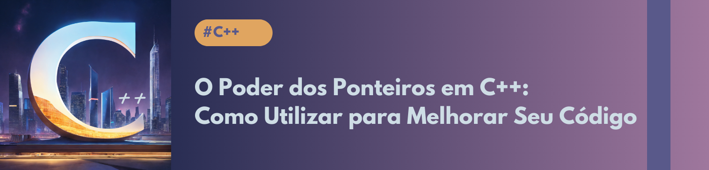

<p align="center">
    
</p>

# 👨‍💻 Projeto de produção de artigo

O projeto teve como objetivo aprender um assunto novo, desevolver um artigo de conteúdo didático sobre o assunto, de maneira a testar e melhorar meu entendimento ao tentar explica-lo, além de gerar um conteúdo útil a quem também deseja aprender o assuto.

## 📚 Materiais

- `Assets` contêm as imagens utilizadas.
- `Output` contêm o artigo produzido.

## 🚶‍♂️ Passo a passo da construção do artigo:

No desenvolvimento desse artigo defini um assunto que eu tinha interesse em aprender, busquei uma imagem interessante e relacioanda ao assunto na Lexica.art fiz alterações e montei um banner no canva com o título.

Para iniciar o aprendizado no assunto montei um prompt no chatGPT para que me explicasse e me desse uma noção geral do assunto e me servisse de base para construção do artigo, o prompt montado pode ser visto a seguir:

Prompt chatGPT
```
Escreva um artigo sobre ponteiros em C++
{Regras}
Comporte-se com um escritor de artigos de tecnologia e programação
O artigo deve conter o que são ponteiros, comparação de código com e sem ponteiros, quando e como usar, como melhorar os códigos usando ponteiro, e exemplos de código dos conceitos abordados.
```

Em seguida, já tendo uma leve noção de ponteiros, lí o [tutorial da Cplusplus sobre ponteiros](https://cplusplus.com/doc/tutorial/pointers/), que está bem completo, não deixe de conferir, ele conta com diversos exemplos e tutoriais de uso de ponteiros e funcionalidades que aqui não foram detalhados.

Após isso, lapidei a estrutura e o material produzido pelo chatGPT, explicando a minha maneira os tópicos instituídos, julgando e alterando para que ficasse mais claro de entender ou pudesse trabalhar melhor algum conceito.

Aprender um assunto novo e explicar é muito bom para a organização e estruturação do que foi aprendido para nós mesmos, além de ajudar outras pessoas interessadas no assunto. Convido você leitor a montar um artigo também do seu interesse.


## 💻 Tecnologias utilizadas na construção do projeto

- [Lexica.art.](https://lexica.art)
- [Canva.](https://www.canva.com/pt_br/)
- [ChatGPT.](https://chatgpt.com)


## 🧭 Fontes de produção

- Ilustração da capa: Gerada por Lexica.art.


## 🌏 Redes sociais

Atutor: Gabriel Ferreira Vieira.

[Linkedin](https://www.linkedin.com/in/gabriel-ferreira-vieira-b0a0532b1/) | [GitHub](https://github.com/FerrariusF)
